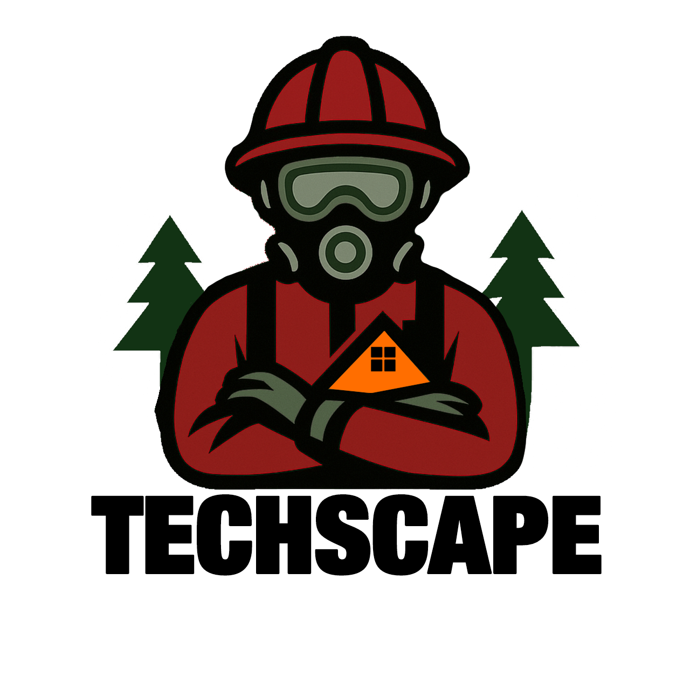

# ⭑ 📃Table of Contents 
  - [Introduction](#who-are-we-and-whats-our-project-about)
  - [Team members](#team-members)
  - [Our application](#what-our-application-does)
  - [Technologies](#used-technologies)
  - [Installing & running the project](#how-to-install-and-run-the-project)
  - [Using the project](#how-to-use-the-project)
  - [Help/Questions](#-where-to-get-help)

# ⭑🧑‍🎓Who are we and what's our project about?

## Welcome to the Techscape project - our goal is to support firefighters in their daily work by giving them easy access to real-time information such as team schedules, vehicle availability, equipment details, and active incident reports, so they can respond faster, stay organized, and work more efficiently in critical situations.

# ⭑🫂Team Members
- ### <a href = "https://github.com/darialarichkina"> FrontEnd Developer - Daria Andreevna Larichkina </a> 
- ### <a href = "https://github.com/ddzavalishin23"> Scrum Trainer - Raya Krasimirova Kirilova </a>
- ### <a href = "https://github.com/gyastoyanova23"> Designer - Gabriela Yasenova Stoyanova </a>
- ### <a href = "https://github.com/Hristiyan1423"> BackEnd Developer - Hristiyan Atanasov Grozdev </a>

# ⭑💡What our Application does?
## Our application consists of a main file, headers, and functions related to each other. This structure ensures a more efficient and comprehensive approach to code implementation. Most questions require numerical answers; however, there are also open-ended questions where users must type their responses. At the end of the test, users receive a grade based on their answers. The highest grade is 6, indicating an excellent result, while the lowest grade is 2, signifying a poor outcome.
# ⭑💻Used Technologies:
work in progress 

# ⭑📥How to Install and Run the Project
### In order to install our project locally, open CMD and run this command:
<pre>https://github.com/codingburgas/9th-grade-html-project-techscape.git</pre>

# ⭑🚀How to Use the Project 
work in progress 

# ⭑📧 Where to Get Help
### If you need help with this project, you can use the following resources:

## 1. **Documentation**: Check the official documentation for detailed guides and references.
   
## 2. **Microsoft Teams**.
   Elizaveta - evfurnika23@codingburgas.bg
   
   Daria - dalarichkina23@codingburgas.bg
   
   Varvara - vnsaphonova23@codingburgas.bg
   
   Svyatoslav - svsidorov23@codingburgas.bg

   Denis - ddzavalishin23@codingburgas.bg

   Nikol - nsstoyanova22@codingburgas.bg  
## 3. **Email Support**: For more personalized help, you can email us. The email adresses are equal to the ones above.

### Feel free to reach out through any of these options, and we'll be happy to assist you!❤️
