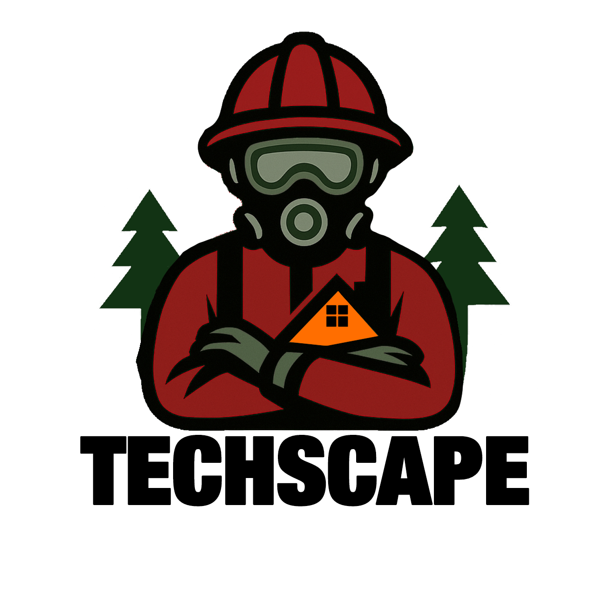

<h1 align="center"> TechScape </h1>
<h3 align="center">Push limits, embrace growth</h3>  
 

 

## 📃TABLE OF CONTENTS 

    
Table of Contents

    <li><a href="#about-the-project">  The Project</a></li>
    <li><a href="#used-technologies">  Technologies</a></li>
    <li><a href="#download">    Download</a></li>

## 💡ABOUT THE PROJECT 

    
Welcome to the Techscape project - our goal is to support firefighters in their daily work by giving them easy access to real-time information such as team schedules, vehicle availability, equipment details, and active incident reports, so they can respond faster, stay organized, and work more efficiently in critical situations.

<h2>🧑‍🎓Members</h2>

- ### <a href = "https://github.com/darialarichkina"> FrontEnd Developer - Daria Andreevna Larichkina </a> 
- ### <a href = "https://github.com/ddzavalishin23"> Scrum Trainer - Raya Krasimirova Kirilova </a>
- ### <a href = "https://github.com/gyastoyanova23"> Designer - Gabriela Yasenova Stoyanova </a>
- ### <a href = "https://github.com/Hristiyan1423"> BackEnd Developer - Hristiyan Atanasov Grozdev </a>

##  💻Used Technologies
-  <a href="https://visualstudio.microsoft.com/vs/">Visual Studio 2022</a>
-  <a href="https://github.com/">GitHub</a>
-  <a href="project/public/TechScape.docx">MS Word</a>
-  <a href="project/public/TechScape.pptx ">MS PowerPoint</a>
-  <a href="https://www.microsoft.com/en-us/microsoft-teams/group-chat-software">MS Teams</a>

<!-- CONTRIBUTORS -->

<h2 id="download">Download</h2>

To download our project, clone our repository by pasting this command in your command prompt:

<pre align="center">git clone "https://github.com/codingburgas/9th-grade-html-project-techscape.git"</pre>

<h2 align="center">Thanks for checking out our repo!❤️</h2>
